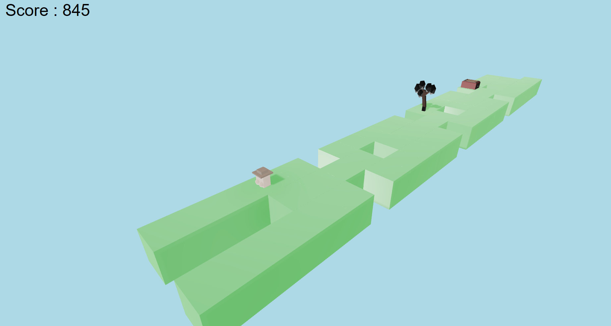

# Poly Run

This is the prototype of an 3D Runner game made in a 1 week long jam environment.
This is made using GC-Render, a custom rendering library made by the students of Gaming Campus Lyon.



## Features

- 3 different biomes
- Biome specific obstacles
- Gravity inversion

## Tech Stack

- **Language:** C++
- **Rendering:** Custom Dx12 engine
- **Build system:** Custom
- **Platform:** Windows

## Project Structure

```
src/         → Engine and Sandbox source code
vendor/      → Third-party dependencies (GC-Render)
res/         → Runtime resources (fonts, textures, etc.)
```

## Building from Source

If you want to try it yourself

```bash
git clone https://github.com/vivienSINGIER/Runner3D.git
cd Runner3D
```

1. Run `make.bat` in the bin folder.
2. Open the generated solution in Visual Studio.
3. Build the **Sandbox** project.
4. Run via the ide or the `Sandbox.exe` inside the ide folder.

**Requirements:**
- Visual Studio 2022 (or compatible MSVC toolset)
- Windows 10/11

## Controls

| Key / Input | Action |
|---|---|
| `LEFT-RIGHT` | Move |
| `Space` | Jump |

